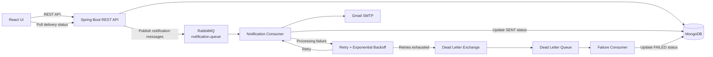

# Async Notification System

A full-stack, production-oriented asynchronous bulk notification and delivery tracking system built using **Spring Boot, React, MongoDB, RabbitMQ, and SMTP**.

The project demonstrates how a synchronous bulk email workflow can be redesigned using message-driven asynchronous processing to improve API responsiveness, reliability, failure handling, and delivery visibility.

---

## Problem Statement

Consider a newsletter system where an administrator needs to send an email notification to all subscribed users.

A simple implementation could process every recipient synchronously:

```text
Client
  ↓
POST /notifications
  ↓
Fetch Subscribers
  ↓
Send Email 1
  ↓
Send Email 2
  ↓
Send Email 3
  ↓
...
  ↓
Return HTTP Response
```

The HTTP request remains occupied until all recipients are processed.

During the initial synchronous implementation, a test with **11 recipients** and simulated downstream email latency resulted in an API response time of approximately:

> **6.31 seconds**

As the subscriber count grows, this approach does not provide a good user-facing API experience.

The notification workflow was therefore redesigned using **RabbitMQ** to decouple notification delivery from the HTTP request.

---

## Solution

The asynchronous implementation follows this flow:

```text
React
  ↓
Spring Boot REST API
  ↓
Create Notification
  ↓
Create PENDING delivery records
  ↓
Publish messages to RabbitMQ
  ↓
202 Accepted
```

Email delivery then continues independently:

```text
RabbitMQ
   ↓
Notification Consumer
   ↓
Gmail SMTP
   ↓
Email
   ↓
Update delivery status
   ↓
SENT / FAILED
```

This allows the API to return without waiting for every email delivery operation to finish.

---

## Architecture



---

## Application Flow

### 1. Subscriber Registration

Users can subscribe individually using their email address.

```text
React
  ↓
POST /api/subscribers
  ↓
Spring Boot
  ↓
MongoDB
```

Subscriber emails are protected by a **unique MongoDB index** to prevent duplicate records.

Subscribers can also be marked inactive when they unsubscribe.

---

### 2. Bulk Subscriber Import

Administrators can upload subscribers using a CSV file.

Example:

```csv
email
user1@example.com
user2@example.com
user3@example.com
```

The import process:

```text
CSV Upload
   ↓
Stream CSV Records
   ↓
Normalize Email
   ↓
Validate
   ↓
Detect In-File Duplicates
   ↓
Process Batch
   ↓
Bulk Lookup Existing Subscribers
   ↓
Bulk Save New Subscribers
   ↓
MongoDB
```

The API returns an import summary:

```json
{
  "totalRecords": 12,
  "imported": 6,
  "duplicates": 5,
  "invalid": 1
}
```

### Bulk Import Design

The implementation uses:

- Apache Commons CSV for CSV parsing
- Streaming file processing
- `HashSet` for in-file duplicate detection
- Batch processing
- MongoDB bulk lookup using `findByEmailIn(...)`
- `saveAll(...)` for batch persistence
- Unique database index as the final consistency guarantee
- File-size limits to protect the upload endpoint

This avoids performing an individual database lookup and insert for every CSV row.

---

## Asynchronous Notification Processing

When an administrator submits a newsletter:

```text
POST /api/notifications
```

the backend:

1. Creates the notification.
2. Retrieves active subscribers.
3. Creates a `PENDING` delivery record for every recipient.
4. Publishes a notification message to RabbitMQ for each recipient.
5. Returns **HTTP 202 Accepted**.

Example RabbitMQ message:

```json
{
  "notificationId": "68ad...",
  "email": "subscriber@example.com",
  "subject": "Product Update",
  "message": "New features are now available."
}
```

The RabbitMQ consumer independently processes each message and sends the email through SMTP.

---

## Delivery Tracking

Asynchronous processing means the initial API response does not indicate that every email has already been delivered.

Therefore, each recipient has an individual delivery record in MongoDB.

Supported states:

```text
PENDING
   ↓
 SENT
```

or:

```text
PENDING
   ↓
Retry
   ↓
FAILED
```

The frontend retrieves progress using:

```http
GET /api/notifications/{notificationId}/status
```

Example response while processing:

```json
{
  "notificationId": "68ad...",
  "total": 7,
  "pending": 3,
  "sent": 4,
  "failed": 0
}
```

The React frontend polls this endpoint periodically and updates the delivery progress automatically.

Polling stops once:

```text
pending = 0
```

---

## Retry and Dead-Letter Handling

Email providers and external services can fail temporarily.

The RabbitMQ listener therefore uses bounded retries with exponential backoff.

```text
Message
  ↓
Consumer
  ↓
Attempt 1 ❌
  ↓
Wait
  ↓
Attempt 2 ❌
  ↓
Wait Longer
  ↓
Attempt 3 ❌
  ↓
Retries Exhausted
  ↓
Dead Letter Exchange
  ↓
Dead Letter Queue
  ↓
Failure Consumer
  ↓
MongoDB → FAILED
```

The implementation prevents permanently failing messages from being retried indefinitely.

A failed delivery retains failure information in MongoDB so RabbitMQ is not used as the application's historical business-state store.

---

## Email Delivery

Emails are sent using Spring's `JavaMailSender` through Gmail SMTP.

```text
RabbitMQ Consumer
       ↓
Email Service
       ↓
JavaMailSender
       ↓
Gmail SMTP
       ↓
Recipient
```

A delivery is marked `SENT` after the SMTP send operation completes successfully.

> SMTP acceptance indicates that the provider accepted the send operation; it does not guarantee that the recipient opened or read the email.

---

## Synchronous vs Asynchronous Processing

The functionality was initially implemented synchronously to establish a baseline.

### Synchronous Implementation

With 11 recipients and simulated downstream latency:

```text
11 recipients
      ↓
Sequential processing
      ↓
API waits for completion
      ↓
Response time ≈ 6.31 seconds
```

### RabbitMQ Implementation

After introducing RabbitMQ:

```text
HTTP Request
     ↓
Create delivery records
     ↓
Publish messages
     ↓
Return response

-------------------------

RabbitMQ
     ↓
Consumers
     ↓
Email processing continues independently
```

The API returned in **milliseconds during local testing**, while email processing continued asynchronously.

> RabbitMQ reduces user-facing request latency by decoupling long-running work from the HTTP request. It does not mean the total email-processing time becomes zero.

---

## Frontend

The React dashboard provides:

- Individual subscriber registration
- CSV bulk subscriber import
- Newsletter submission
- Live delivery progress
- Sent / Pending / Failed counters
- Processing progress indicator
- Success and failure feedback

The frontend uses React hooks including:

- `useState`
- `useEffect`

Delivery progress is retrieved through periodic status API polling.

---

## Screenshots

### Asynchronous Processing in Progress


The frontend displays notification progress while RabbitMQ consumers process messages asynchronously.

### Processing Completed


### Synchronous Performance Baseline


### RabbitMQ Queue and Dead-Letter Queue


### Real Email Delivery


---

## Technology Stack

### Backend

- Java
- Spring Boot
- Spring Web MVC
- Spring Data MongoDB
- Spring AMQP
- Spring Mail
- Bean Validation
- Spring Boot Actuator
- Apache Commons CSV
- Lombok

### Frontend

- React
- JavaScript
- Vite
- Axios
- CSS

### Infrastructure

- MongoDB
- RabbitMQ / CloudAMQP
- Gmail SMTP

### Development Tools

- IntelliJ IDEA
- VS Code
- Postman
- MongoDB Compass
- Git / GitHub

---

## API Overview

| Method | Endpoint | Purpose |
|---|---|---|
| `POST` | `/api/subscribers` | Register subscriber |
| `DELETE` | `/api/subscribers/{email}` | Unsubscribe user |
| `POST` | `/api/subscribers/import` | Bulk import subscribers using CSV |
| `POST` | `/api/notifications` | Submit notification for asynchronous processing |
| `GET` | `/api/notifications/{id}/status` | Retrieve delivery progress |
| `GET` | `/actuator/health` | Application health |

---

## Configuration and Secrets

Credentials are **not stored in source control**.

Spring Boot configuration references environment variables.

Required:

```text
RABBITMQ_URL
MAIL_USERNAME
MAIL_APP_PASSWORD
```

Optional/local configuration:

```text
MONGODB_URI
MONGODB_DATABASE
CORS_ALLOWED_ORIGIN
MAIL_HOST
MAIL_PORT
```

Example:

```properties
spring.rabbitmq.addresses=${RABBITMQ_URL}

spring.mail.username=${MAIL_USERNAME}
spring.mail.password=${MAIL_APP_PASSWORD}

spring.data.mongodb.uri=${MONGODB_URI:mongodb://localhost:27017/notification_system_db}
```

For production deployments, secrets should be supplied through the deployment platform or a dedicated secrets-management solution rather than committed to the repository.

---

## Running Locally

### Prerequisites

- Java
- Maven
- Node.js / npm
- MongoDB
- RabbitMQ connection
- SMTP credentials

### 1. Configure Environment Variables

Set:

```text
RABBITMQ_URL=<rabbitmq-connection-url>
MAIL_USERNAME=<smtp-username>
MAIL_APP_PASSWORD=<smtp-app-password>
```

MongoDB defaults to:

```text
mongodb://localhost:27017/notification_system_db
```

### 2. Start Backend

```bash
cd backend
mvn spring-boot:run
```

Backend:

```text
http://localhost:8080
```

### 3. Start Frontend

```bash
cd frontend
npm install
npm run dev
```

Frontend:

```text
http://localhost:5173
```

---

## Project Structure

```text
async-notification-system/
│
├── backend/
│   ├── src/
│   ├── pom.xml
│   └── ...
│
├── frontend/
│   ├── src/
│   ├── package.json
│   └── ...
│
├── screenshots/
│   ├── dashboard-processing.png
│   ├── dashboard-completed.png
│   ├── synchronous-response.png
│   ├── rabbitmq-dlq.png
│   └── gmail-delivery.png
│
└── README.md
```

---

## Key Engineering Decisions

**Why RabbitMQ instead of synchronous email processing?**

Email delivery is an external, comparatively slow operation. RabbitMQ decouples it from the HTTP request lifecycle so the API does not remain blocked while every recipient is processed.

**Why HTTP 202 Accepted?**

The server has accepted the notification request, but asynchronous processing may still be in progress when the response is returned.

**Why store delivery state in MongoDB?**

RabbitMQ handles message transport and work distribution. MongoDB maintains application business state and delivery history.

**Why a DLQ?**

Messages that repeatedly fail should not be retried indefinitely or interfere with normal processing. Dead-letter handling isolates permanently failing messages.

**Why CSV streaming and batching?**

It reduces unnecessary memory usage and database round trips compared with materializing the entire import and performing one query/write per row.

**Why database uniqueness if duplicates are already checked in Java?**

Application checks provide convenient duplicate handling, while the database unique index provides the final consistency guarantee against concurrent requests.

---

## Current Scope

This project focuses on the notification-processing capability itself.

Potential extensions include:

- Authentication and role-based authorization
- Multiple notification channels
- HTML email templates
- Multiple RabbitMQ consumers / horizontal scaling
- WebSocket or Server-Sent Events instead of polling
- Notification scheduling
- Provider abstraction for different email services
- Metrics and distributed tracing
- Transactional Outbox for stronger database/message consistency

---

## What This Project Demonstrates

The project focuses on practical backend and full-stack engineering concepts:

- Synchronous vs asynchronous processing
- Message-driven architecture
- Producer/consumer communication
- Retry and exponential backoff
- Dead-letter queues
- REST API design
- HTTP `202 Accepted`
- Eventual consistency
- Delivery-state tracking
- Bulk data processing
- Database batching
- Duplicate handling
- External SMTP integration
- Runtime configuration and secret management
- React state management and polling
- End-to-end full-stack integration
